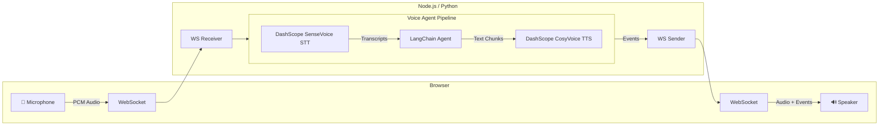

# Voice Sandwich Demo 🥪

A real-time, voice-to-voice AI pipeline demo featuring a sandwich shop order assistant. Built with LangChain/LangGraph agents, **DashScope (阿里云)** for speech-to-text (SenseVoice), text-to-speech (CosyVoice), and LLM (Qwen).

> **Note**: 本项目已全面切换至阿里云 DashScope 服务，支持中文语音识别和语音合成。

## Architecture

The pipeline processes audio through three transform stages using async generators with a producer-consumer pattern:



### Pipeline Stages

Each stage is an async generator that transforms a stream of events:

1. **STT Stage** (`sttStream`): Streams audio to DashScope SenseVoice, yields transcription events (`stt_chunk`, `stt_output`)
   - 支持中文、英文、日语、粤语、韩语自动检测
2. **Agent Stage** (`agentStream`): Passes upstream events through, invokes LangChain agent with DashScope Qwen on final transcripts, yields agent responses (`agent_chunk`, `tool_call`, `tool_result`, `agent_end`)
3. **TTS Stage** (`ttsStream`): Passes upstream events through, sends agent text to DashScope CosyVoice, yields audio events (`tts_chunk`)
   - 支持中文语音合成，音色可选：longhua（男声）、shujing（女声）

## Prerequisites

- **Node.js** (v18+) or **Python** (3.11+)
- **pnpm** or **uv** (Python package manager)

### API Keys

| Service | Environment Variable | Purpose |
|---------|---------------------|---------|
| **DashScope** | `DASHSCOPE_API_KEY` | Qwen 大模型 + SenseVoice 语音识别 + CosyVoice 语音合成 |

#### DashScope 阿里云配置

1. 访问 [DashScope 控制台](https://dashscope.console.aliyun.com/) 获取 API Key
2. 设置环境变量：
   ```bash
   export DASHSCOPE_API_KEY="sk-xxxxxx"
   ```

**可用模型：**
- **LLM**: `qwen-plus`, `qwen-max`, `qwen-turbo`
- **语音识别**: `sensevoice-v1` (支持 zh/en/ja/yue/ko)
- **语音合成**: `cosyvoice-v1` (音色: longhua, shujing, longcheng)

## Quick Start

### Using Make (Recommended)

```bash
# Install all dependencies
make bootstrap

# Run TypeScript implementation (with hot reload)
make dev-ts

# Or run Python implementation (with hot reload)
make dev-py
```

The app will be available at `http://localhost:8000`

### Manual Setup

#### TypeScript

```bash
cd components/typescript
pnpm install
cd ../web
pnpm install && pnpm build
cd ../typescript
pnpm run server
```

#### Python

```bash
cd components/python
uv sync --dev
cd ../web
pnpm install && pnpm build
cd ../python
uv run src/main.py
```

## Project Structure

```
components/
├── web/                 # Svelte frontend (shared by both backends)
│   └── src/
├── typescript/          # Node.js backend
│   └── src/
│       ├── index.ts     # Main server & pipeline
│       ├── dashscope/   # DashScope clients (SenseVoice STT, CosyVoice TTS)
│       ├── types.ts     # TypeScript type definitions
│       └── utils.ts     # Utility functions
└── python/              # Python backend
    └── src/
        ├── main.py                 # Main server & pipeline
        ├── dashscope_stt.py        # DashScope SenseVoice 语音识别
        ├── dashscope_tts.py        # DashScope CosyVoice 语音合成
        ├── dashscope_prompts.py    # 中文语音合成提示词优化
        ├── events.py               # Event type definitions
        └── utils.py                # Utility functions
```

## Event Types

The pipeline communicates via a unified event stream:

| Event | Direction | Description |
|-------|-----------|-------------|
| `stt_chunk` | STT → Client | Partial transcription (real-time feedback) |
| `stt_output` | STT → Agent | Final transcription |
| `agent_chunk` | Agent → TTS | Text chunk from agent response |
| `tool_call` | Agent → Client | Tool invocation |
| `tool_result` | Agent → Client | Tool execution result |
| `agent_end` | Agent → TTS | Signals end of agent turn |
| `tts_chunk` | TTS → Client | Audio chunk for playback |